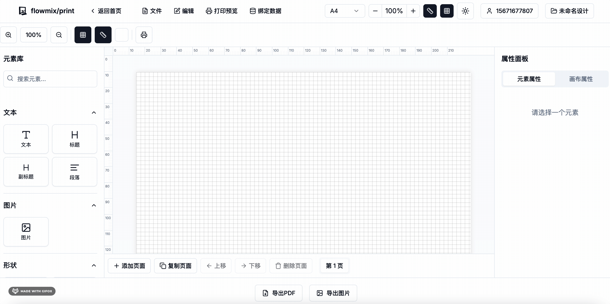

# flowmix-print 专业可视化打印设计平台
An out-of-the-box visual printing platform

## 产品介绍

FlowMix/Print 是一个专业的可视化打印设计平台，让用户能够轻松创建高质量的打印设计，无需专业设计软件。通过直观的拖拽界面和丰富的元素库，用户可以快速设计并生成适用于各种场景的打印文档。

### 主要特点

- **所见即所得的设计体验**：实时预览设计效果，无需复杂操作
- **丰富的元素库**：支持文本、图片、形状、表格、图标、图表、条形码等多种元素
- **多页面管理**：轻松创建和管理多页文档
- **高质量导出**：支持PDF、高分辨率图片导出和直接打印
- **数据绑定**：支持将设计元素与数据源绑定，生成动态内容
- **用户认证**：完整的用户注册、登录和权限管理系统
- **本地存储**：自动保存设计，防止数据丢失
- **响应式设计**：适配不同屏幕尺寸的设备

### 适用场景

FlowMix/Print 适用于多种行业和场景：

- **政府机构**：公文、证书、表格、档案
- **零售行业**：价格标签、促销海报、产品目录、会员卡
- **物流行业**：运单、标签、包装设计、仓储标识
- **制造业**：产品说明书、检验报告、操作手册、质检标签
- **教育机构**：证书、教材、试卷、学生证
- **医疗行业**：处方、病历表格、医疗报告、患者标识
- **金融行业**：合同、报表、账单、财务分析

## 技术架构

FlowMix/Print 采用现代化的前端技术栈，基于 React 和 Next.js 构建，实现了高性能、可扩展的打印设计平台。

### 架构概览

系统架构分为以下几个主要层次：

1. **用户界面层**：处理用户交互和视图渲染
2. **编辑器核心层**：系统的中枢，协调各个子系统
3. **元素系统**：管理和渲染各种设计元素
4. **数据层**：负责数据的存储、加载和处理
5. **输出系统**：将设计转换为最终产品
6. **认证系统**：负责用户管理和权限控制

## 技术栈

### 前端框架和库

- **React 18**：用户界面构建
- **Next.js 13**：应用框架和服务端渲染
- **TypeScript**：类型安全的代码开发
- **Zustand**：状态管理
- **React DnD**：拖放功能
- **React-Rnd**：可调整大小和位置的组件

### UI 组件和样式

- **Tailwind CSS**：实用优先的 CSS 框架
- **Shadcn UI**：高质量 UI 组件集合
- **Ant Design**：企业级 UI 组件库
- **Lucide React**：现代图标库

### 图形和可视化

- **Chart.js**：图表可视化库
- **React-Quill**：富文本编辑器
- **html2canvas**：HTML 转换为 Canvas 图像
- **jsPDF**：客户端 PDF 生成
- **JSBarcode**：条形码生成
- **React-Barcode**：React 条形码组件

### 数据处理和存储

- **IndexedDB**：客户端数据库存储
- **LocalStorage**：轻量级本地存储
- **JSZip**：ZIP 文件处理
- **UUID**：唯一标识符生成

### 开发和构建工具

- **ESLint**：代码质量检查
- **PostCSS**：CSS 转换和优化
- **SWC**：快速的 JavaScript/TypeScript 编译器
- **Autoprefixer**：自动添加 CSS 前缀

关注【趣谈前端】公众号，获取更多技术干货，项目最新进展，和开源实践。

## 在线办公相关解决方案

1. [flowmix/docx多模态文档编辑器](https://flowmix.turntip.cn)
2. [灵语AI文档](https://mindlink.turntip.cn)
3. [H5-Dooring智能零代码平台](https://github.com/MrXujiang/h5-Dooring)

